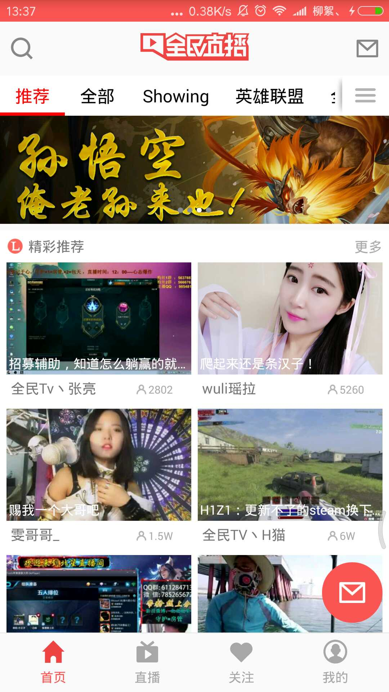
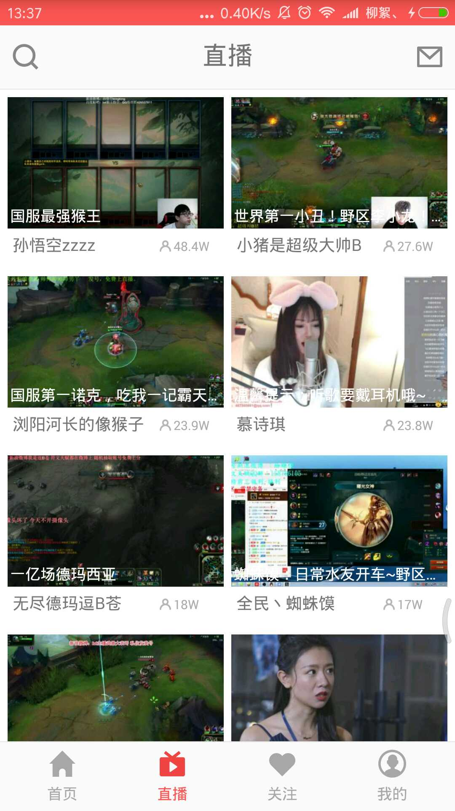

# KingTV

    本App 采用 MVP + RXJava + Retrofit + OKHttp + Material Design + Dagger2 + Base + Glide 等相关库
高仿全民直播Android App。

# 相关截图

# 二维码下载

## 声明
    本App纯属个人作品，是高仿全民直播Android App 3.0.1版本，仅供技术参考，请维护全民直播平台的合法权益，禁止用于一切商业用途。如有疑问请联系作者<jenly1314@gmail.com>，谢谢合作。